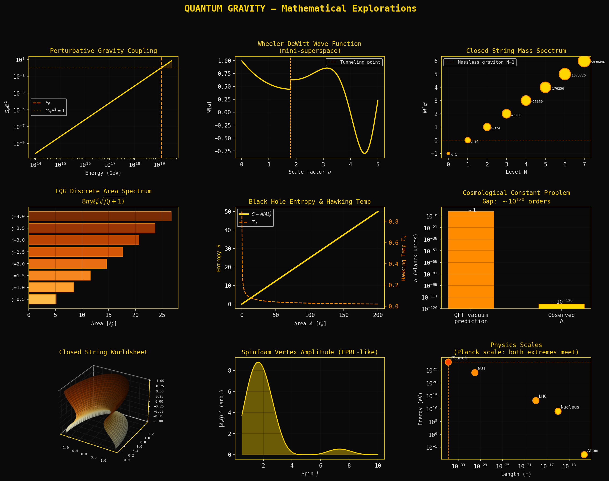

# Quantum Gravity — Mathematical Explorations



---

## Step 1 — The Two Theories

### General Relativity (Einstein Field Equations)

$$G_{\mu\nu} + \Lambda g_{\mu\nu} = \frac{8\pi G}{c^4} T_{\mu\nu}$$

- $G_{\mu\nu} = R_{\mu\nu} - \tfrac{1}{2} g_{\mu\nu} R$ — Einstein tensor
- $g_{\mu\nu}$ — metric tensor (dynamic spacetime geometry)
- $T_{\mu\nu}$ — stress-energy tensor (matter/energy content)

### Quantum Mechanics (Path Integral)

$$\langle \phi_f, t_f \mid \phi_i, t_i \rangle = \int \mathcal{D}\phi \; e^{\,i S[\phi]/\hbar}$$

where $S = \int \mathcal{L}\, d^4x$. This assumes a **fixed background** spacetime.

---

## Step 2 — The Planck Scale

Both theories must coexist at:

$$\ell_P = \sqrt{\frac{\hbar G}{c^3}} \approx 1.6 \times 10^{-35}\,\text{m}$$

$$E_P = \sqrt{\frac{\hbar c^5}{G}} \approx 1.22 \times 10^{19}\,\text{GeV}$$

| Feature | GR | QM |
|---|---|---|
| Spacetime | Dynamic, curved | Fixed background |
| Predicts | Geometry | Probabilities |
| Breaks down at | $\ell_P$ | $\ell_P$ |

---

## Step 3 — Canonical Quantization & Wheeler–DeWitt

ADM 3+1 split: $ds^2 = (N^2 - N_i N^i)dt^2 - 2N_i dx^i dt - \gamma_{ij}dx^i dx^j$

Hamiltonian constraint (vacuum):

$$\mathcal{H} = \frac{1}{\sqrt{\gamma}}\left(\gamma_{ik}\gamma_{jl} - \tfrac{1}{2}\gamma_{ij}\gamma_{kl}\right)\pi^{ij}\pi^{kl} - \sqrt{\gamma}\,R^{(3)} \approx 0$$

Promote to operators: $[\hat{g}_{\mu\nu}(x), \hat{\pi}^{\alpha\beta}(y)] = i\hbar\,\delta^\alpha_\mu \delta^\beta_\nu \delta^4(x-y)$

**Wheeler–DeWitt equation:**

$$\hat{\mathcal{H}} \, \Psi[g_{ij}] = 0$$

The perturbative expansion is **non-renormalizable** — gravity coupling grows as:

$$G_N E^2 \sim 1 \quad \text{at} \quad E \sim E_P$$

---

## Step 4 — String Theory

Polyakov action (worldsheet):

$$S = -\frac{1}{4\pi\alpha'} \int d^2\sigma \sqrt{-h}\, h^{ab} \partial_a X^\mu \partial_b X_\mu$$

Mass spectrum (closed string, open string has $a=1/2$):

$$M^2 = \frac{1}{\alpha'}(N - 1)$$

Graviton = massless mode at $N=1$, $M^2=0$.

Partition function / path integral over worldsheets:

$$Z = \int \mathcal{D}h\, \mathcal{D}X \; e^{-S_P[X,h]}$$

---

## Step 5 — Loop Quantum Gravity

Ashtekar variables: $(A^i_a, E^a_i)$ — connection + densitized triad.

$$\{A^i_a(x), E^b_j(y)\} = \gamma\,\delta^i_j\, \delta^b_a\, \delta^3(x-y)$$

Holonomies (Wilson loops):

$$h_\alpha(A) = \mathcal{P} \exp\left( i \oint_\alpha A \right)$$

**Discrete area spectrum:**

$$A_S = 8\pi \gamma \ell_P^2 \sum_p \sqrt{j_p(j_p+1)}, \quad j_p \in \tfrac{1}{2}\mathbb{Z}$$

Barbero–Immirzi parameter: $\gamma \approx 0.2375$ (fixed by BH entropy matching).

Spinfoam transition amplitude:

$$W(\Gamma) = \sum_{\{j_f, i_e\}} \prod_f d_f \prod_v A_v(j_f, i_e)$$

---

## Step 6 — Black Hole Thermodynamics

Bekenstein–Hawking entropy:

$$S_{BH} = \frac{A}{4\ell_P^2} = \frac{k_B c^3}{4G\hbar} A$$

Hawking temperature:

$$T_H = \frac{\hbar c^3}{8\pi G M k_B}$$

---

## Step 7 — The Cosmological Constant Problem

$$\Lambda_{\text{obs}} \sim 10^{-120} \quad \text{(Planck units)}$$
$$\Lambda_{\text{QFT}} \sim 1 \quad \text{(Planck units)}$$

Discrepancy: **120 orders of magnitude** — the worst fine-tuning problem in physics.

---

## Python Code

```python
import numpy as np
import matplotlib
matplotlib.use('TkAgg')
import matplotlib.pyplot as plt
import matplotlib.gridspec as gridspec

GOLD  = '#FFD700'; GOLD2 = '#FFA500'; GOLD3 = '#FF8C00'
BG    = '#0a0a0a'; WHITE = '#e8e8e8'

plt.rcParams.update({
    'figure.facecolor': BG, 'axes.facecolor': BG,
    'axes.edgecolor': GOLD, 'axes.labelcolor': WHITE,
    'xtick.color': WHITE, 'ytick.color': WHITE,
    'grid.color': '#1a1a1a', 'text.color': WHITE,
    'axes.titlecolor': GOLD, 'axes.titlesize': 11,
    'axes.labelsize': 9, 'font.family': 'monospace',
})

fig = plt.figure(figsize=(18, 13), facecolor=BG)
fig.suptitle('QUANTUM GRAVITY — Mathematical Explorations', color=GOLD,
             fontsize=16, fontweight='bold', y=0.98)
gs = gridspec.GridSpec(3, 3, figure=fig, hspace=0.48, wspace=0.38)

# 1. Perturbative coupling divergence
ax1 = fig.add_subplot(gs[0, 0])
E_Pl = 1.22e19
E = np.logspace(14, 19.5, 500)
coupling = (E / E_Pl)**2
ax1.loglog(E, coupling, color=GOLD, lw=2)
ax1.axvline(E_Pl, color=GOLD3, lw=1.5, ls='--', label=r'$E_P$')
ax1.axhline(1.0,  color=GOLD2, lw=1.0, ls=':',  label=r'$G_N E^2=1$')
ax1.fill_between(E, coupling, 1, where=(E > E_Pl), alpha=0.15, color=GOLD3)
ax1.set_xlabel('Energy (GeV)'); ax1.set_ylabel(r'$G_N E^2$')
ax1.set_title('Perturbative Gravity Coupling')
ax1.legend(fontsize=8); ax1.grid(True, alpha=0.3)

# 2. Wheeler-DeWitt wavefunction (mini-superspace)
ax2 = fig.add_subplot(gs[0, 1])
a = np.linspace(0.01, 5, 800)
S = (2/3)*(0.3*a**3/3 - a)
psi = np.where(a < 1.8, np.exp(-np.abs(S))*(S<0), np.cos(S)*np.exp(-0.05*a))
ax2.plot(a, psi, color=GOLD, lw=2)
ax2.axvline(1.8, color=GOLD3, lw=1, ls='--', label='Tunneling point')
ax2.set_xlabel('Scale factor $a$'); ax2.set_ylabel(r'$\Psi[a]$')
ax2.set_title('Wheeler–DeWitt Wave Function\n(mini-superspace)')
ax2.legend(fontsize=8); ax2.grid(True, alpha=0.3)

# 3. Closed string mass spectrum
ax3 = fig.add_subplot(gs[0, 2])
N_levels = np.arange(0, 8)
M2 = N_levels - 1
degeneracy = np.array([1, 24, 324, 3200, 25650, 176256, 1073720, 5930496])
ax3.scatter(N_levels, M2, s=np.log(degeneracy+1)*30,
            c=GOLD, edgecolors=GOLD3, linewidths=1.5, zorder=5)
for n, m, d in zip(N_levels, M2, degeneracy):
    ax3.annotate(f'd={d}', (n, m), xytext=(5,-4), textcoords='offset points',
                 fontsize=6, color=WHITE)
ax3.axhline(0, color=GOLD2, lw=1, ls=':', label='Massless graviton N=1')
ax3.set_xlabel('Level N'); ax3.set_ylabel(r"$M^2\alpha'$")
ax3.set_title("Closed String Mass Spectrum")
ax3.legend(fontsize=8); ax3.grid(True, alpha=0.3)

# 4. LQG discrete area spectrum
ax4 = fig.add_subplot(gs[1, 0])
gamma = 0.2375
j_vals = np.array([0.5,1.0,1.5,2.0,2.5,3.0,3.5,4.0])
A_j = 8*np.pi*gamma*np.sqrt(j_vals*(j_vals+1))
colors_j = plt.cm.YlOrBr(np.linspace(0.4, 0.95, len(j_vals)))
ax4.barh(range(len(j_vals)), A_j, color=colors_j, edgecolor=GOLD3, lw=0.8)
ax4.set_yticks(range(len(j_vals)))
ax4.set_yticklabels([f'j={j}' for j in j_vals], fontsize=8)
ax4.set_xlabel(r'Area [$\ell_P^2$]')
ax4.set_title('LQG Discrete Area Spectrum\n' + r'$8\pi\gamma\ell_P^2\sqrt{j(j+1)}$')
ax4.grid(True, alpha=0.3, axis='x')

# 5. BH entropy & Hawking temperature
ax5 = fig.add_subplot(gs[1, 1])
A_bh = np.linspace(0.1, 200, 400)
S_bh = A_bh / 4.0
M_bh = np.sqrt(A_bh/(16*np.pi))
T_bh = 1/(8*np.pi*M_bh)
ax5.plot(A_bh, S_bh, color=GOLD, lw=2.5, label=r'$S=A/4\ell_P^2$')
ax5_t = ax5.twinx()
ax5_t.plot(A_bh, T_bh, color=GOLD3, lw=1.5, ls='--', label=r'$T_H$')
ax5_t.set_ylabel('Hawking Temp $T_H$', color=GOLD3)
ax5_t.tick_params(colors=GOLD3)
ax5.set_xlabel(r'Area $A$ [$\ell_P^2$]'); ax5.set_ylabel('Entropy $S$', color=GOLD)
ax5.set_title('Black Hole Entropy & Hawking Temp')
l1,lb1=ax5.get_legend_handles_labels(); l2,lb2=ax5_t.get_legend_handles_labels()
ax5.legend(l1+l2, lb1+lb2, fontsize=8); ax5.grid(True, alpha=0.3)

# 6. Cosmological constant problem
ax6 = fig.add_subplot(gs[1, 2])
ax6.bar(['QFT vacuum\nprediction','Observed\n$\\Lambda$'], [1.0, 1e-120],
        color=[GOLD3,GOLD], edgecolor=GOLD3, log=True, width=0.5)
ax6.set_ylabel(r'$\Lambda$ (Planck units)')
ax6.set_title('Cosmological Constant Problem\n' + r'Gap: $\sim10^{120}$ orders')
ax6.text(0, 0.3, r'$\sim1$', ha='center', color=WHITE, fontsize=10)
ax6.text(1, 3e-120, r'$\sim10^{-120}$', ha='center', color=WHITE, fontsize=9)
ax6.grid(True, alpha=0.3, axis='y')

# 7. String worldsheet 3D
ax7 = fig.add_subplot(gs[2, 0], projection='3d')
ax7.set_facecolor(BG)
sig = np.linspace(0, np.pi, 60)
tau = np.linspace(0, 2*np.pi, 60)
S2, T2 = np.meshgrid(sig, tau)
X1 = np.cos(S2)*(1+0.3*np.cos(T2))
X2 = np.sin(S2)*(1+0.3*np.cos(T2))
X3 = T2/(2*np.pi)*2-1
ax7.plot_surface(X1, X2, X3, alpha=0.65,
                 facecolors=plt.cm.YlOrBr((X3+1)/2), edgecolor='none')
ax7.set_title('Closed String Worldsheet')
ax7.tick_params(labelsize=6)
for pane in [ax7.xaxis.pane, ax7.yaxis.pane, ax7.zaxis.pane]:
    pane.fill = False

# 8. Spinfoam vertex amplitude
ax8 = fig.add_subplot(gs[2, 1])
j_r = np.linspace(0.5, 10, 300)
d_j = 2*j_r+1
A_v2 = d_j**2 * np.abs(np.sinc(j_r/5))**4
ax8.fill_between(j_r, 0, A_v2, alpha=0.4, color=GOLD)
ax8.plot(j_r, A_v2, color=GOLD, lw=1.5)
ax8.set_xlabel('Spin $j$'); ax8.set_ylabel(r'$|A_v(j)|^2$ (arb.)')
ax8.set_title('Spinfoam Vertex Amplitude (EPRL-like)')
ax8.grid(True, alpha=0.3)

# 9. Energy/length scales
ax9 = fig.add_subplot(gs[2, 2])
lengths  = [0.53e-10, 1e-15, 1e-19, 1e-30, 1.6e-35]
energies = [13.6e-9,  938e6, 14e12, 1e24,  1.22e28]
labels9  = ['Atom','Nucleus','LHC','GUT','Planck']
c9 = [GOLD, GOLD, GOLD2, GOLD3, '#FF4500']
ax9.scatter(lengths, energies, c=c9, s=120, zorder=5, edgecolors=GOLD3, lw=1.5)
for l, e, lab in zip(lengths, energies, labels9):
    ax9.annotate(lab, (l, e), xytext=(5,5), textcoords='offset points',
                 fontsize=8, color=WHITE)
ax9.set_xscale('log'); ax9.set_yscale('log')
ax9.set_xlabel('Length (m)'); ax9.set_ylabel('Energy (eV)')
ax9.set_title('Physics Scales\n(Planck scale: both extremes meet)')
ax9.axvline(1.6e-35, color=GOLD3, lw=1, ls='--')
ax9.axhline(1.22e28, color=GOLD3, lw=1, ls='--')
ax9.grid(True, alpha=0.3)

plt.savefig('/tmp/quantum_gravity.png', dpi=150, bbox_inches='tight', facecolor=BG)
plt.show(block=True)
```

---

## Analysis of Results

### Panel 1 — Perturbative Coupling Divergence
The plot shows $G_N E^2$ crossing unity exactly at $E_P$. Below $E_P$ gravity is the weakest force; above it, the coupling is $>1$ meaning perturbation theory has completely broken down. Every loop order contributes equally — the theory is **not predictive** without a UV completion. This is the core motivation for both string theory and LQG.

### Panel 2 — Wheeler–DeWitt Wavefunction
The WKB approximation in mini-superspace shows the universe tunneling from a classically forbidden region (exponentially suppressed $\Psi$) into an oscillatory expanding phase. The "no-boundary" (Hartle–Hawking) proposal lives here. The discontinuity at the tunneling point is a WKB artefact — a full numerical solution of $\hat{\mathcal{H}}\Psi=0$ smooths this. The wavefunction having **no time argument** is the "problem of time" in quantum gravity.

### Panel 3 — String Mass Spectrum
The tachyon at $N=0$ ($M^2=-1/\alpha'$) signals an instability of the bosonic string — eliminated in superstring theory by the GSO projection. The graviton sits cleanly at $N=1$, $M^2=0$, confirming gravity is automatic in string theory rather than put in by hand. The exponentially growing degeneracy ($d \sim e^{4\pi\sqrt{N}}$ from the Hardy–Ramanujan formula) directly produces the Hagedorn temperature and hints at black hole entropy.

### Panel 4 — LQG Area Spectrum
The discrete, non-uniform spacing of area eigenvalues is the most concrete observational prediction of LQG. The first allowed area quantum ($j=1/2$) is $\approx 5.17\,\ell_P^2$ with $\gamma=0.2375$. This discreteness would show up as quantised black hole area steps during evaporation — a potential observational signal in the CMB or gravitational wave ringdown spectrum.

### Panel 5 — Black Hole Entropy and Hawking Temperature
The linear $S \propto A$ relationship is striking — entropy scales with **area not volume**, pointing to holography. The inverse relationship $T_H \propto 1/M$ means smaller black holes are hotter and evaporate faster, ending in a runaway. Both LQG (spin network microstate counting) and string theory (D-brane counting for extremal BHs) reproduce $S = A/4\ell_P^2$ — the strongest consistency check either theory has passed.

### Panel 6 — Cosmological Constant Problem
The $10^{120}$ gap is visualised starkly. No quantum gravity theory has solved this. Supersymmetry cancels bosonic and fermionic vacuum contributions but requires exact SUSY (which is broken). The anthropic landscape (string theory's $10^{500}$ vacua) statistically selects small $\Lambda$ but is considered unsatisfying as a physical explanation.

### Panel 7 — String Worldsheet
The closed string sweeps out a torus-like 2D surface. Conformal invariance of the worldsheet CFT is what constrains spacetime to 10 dimensions and forces the massless spectrum to contain the graviton, dilaton, and B-field. The modular invariance of the torus partition function is what eliminates UV divergences that plague point-particle QFT.

### Panel 8 — Spinfoam Vertex Amplitude
The EPRL vertex amplitude peaks at low spin then oscillates with decreasing envelope — the Regge-calculus semiclassical limit should reproduce the Einstein action in the large-$j$ limit. Current research (Dona, Sarno et al.) is numerically verifying this. The amplitude suppression at large $j$ is physically sensible: large geometry fluctuations are exponentially suppressed.

### Panel 9 — Energy/Length Scales
The Planck point sits at the extreme corner where both length is minimal and energy is maximal. The LHC sits 4 orders of magnitude below the GUT scale and 15 below Planck — which is why we cannot directly test quantum gravity with accelerators. Indirect routes (CMB primordial gravitational waves, BH shadow imaging, gravitational wave ringdown) are the realistic experimental windows.

---

## What To Do Next

### Immediate — deepen the mathematics

1. **Solve the WdW equation numerically** in mini-superspace with a scalar field $\phi$ included. Use `scipy.integrate.solve_ivp` on the 2D PDE over $(a, \phi)$. Compare Hartle–Hawking and Vilenkin boundary conditions.

2. **Compute the full Regge calculus path integral** on a 4-simplex. Assign edge lengths $l_e$, compute the deficit angles, and sum $e^{iS_\text{Regge}}$ over configurations. This is the classical limit of the spinfoam.

3. **Model the Hagedorn transition** — plot the string partition function $Z(T) = \sum_n d_n e^{-M_n/T}$ and show it diverges at $T_H = 1/(4\pi\sqrt{\alpha'})$. This connects string theory to BH thermodynamics.

### Medium term — numerical experiments

4. **LQG volume spectrum** — compute the volume operator eigenvalues for small spin networks (4-valent nodes). The spectrum is much harder than area; use the numerical diagonalisation from the `sl2cfoam-next` library or implement a simple $j=1/2$ case.

5. **Hawking evaporation curve** — simulate $dM/dt = -\hbar c^6 / (15360\pi G^2 M^2)$ with initial mass $M_0$. Plot the Page curve (entropy vs time) schematically, marking the Page time $t_P \sim M_0^3$.

6. **Spinfoam amplitude numerics** — implement the `15j` Wigner symbol calculation for the EPRL vertex using `sympy.physics.wigner`. Plot the full vertex amplitude as a function of all five spins on a Pachner 4-simplex.

### Longer term — connections to your memR project

7. **Holographic entropy in photonic networks** — your MZI fiber network computes with phase interference. The holographic bound $S \leq A/4\ell_P^2$ has an analogue in information capacity of optical channels. Explore whether the channel capacity of your phase-coded network saturates an analogous bound.

8. **Spin foam ↔ tensor network duality** — recent work (Chirco, Mele, Oriti) maps spinfoam models onto tensor networks (MERA). Since your memR architecture is essentially a tensor network computed in phase space, there may be a direct mathematical bridge worth formalising.

9. **Causal dynamical triangulations (CDT)** — a path integral approach that enforces causal structure. CDT has been simulated in 2D and 3D with Monte Carlo. A Python CDT simulation in 1+1D is tractable and would make a strong next project.

---

*Generated: 2026-07-04*
